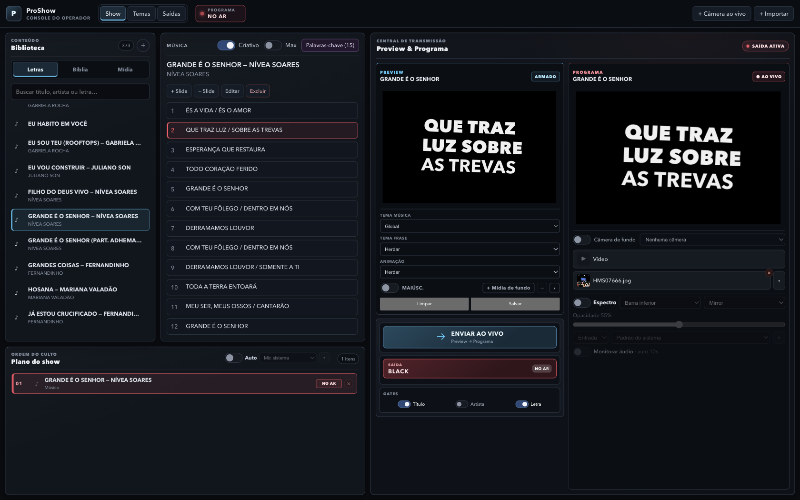
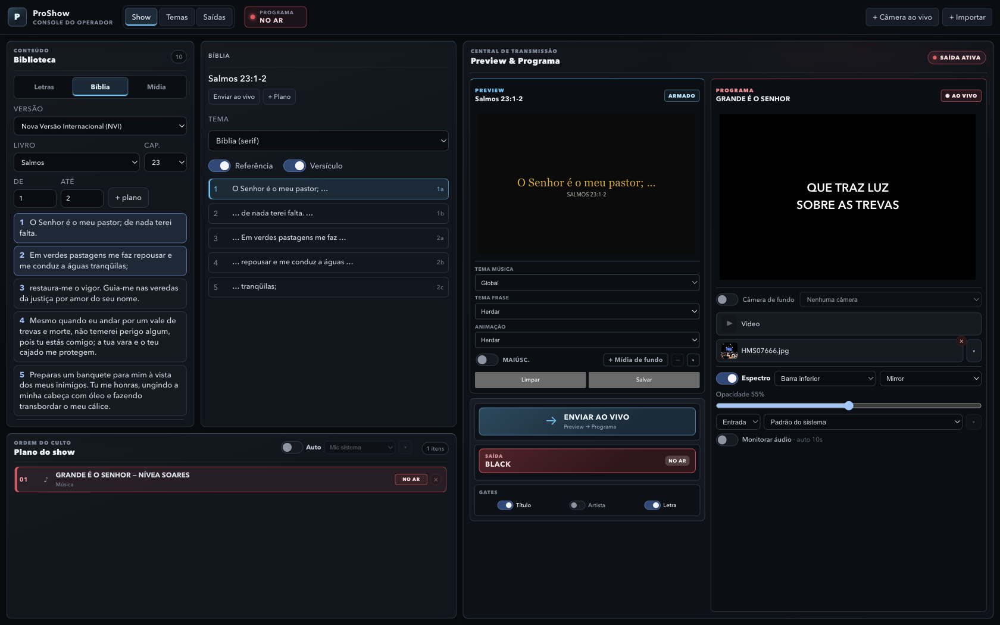
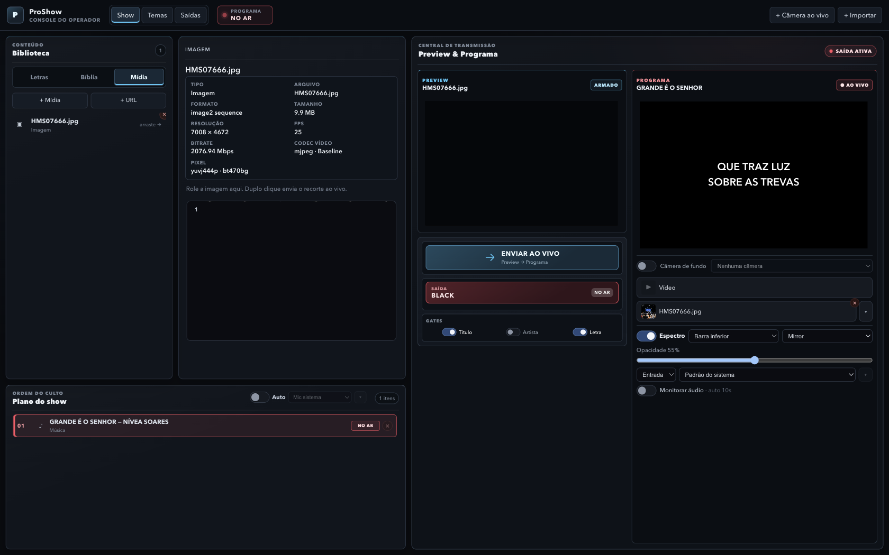
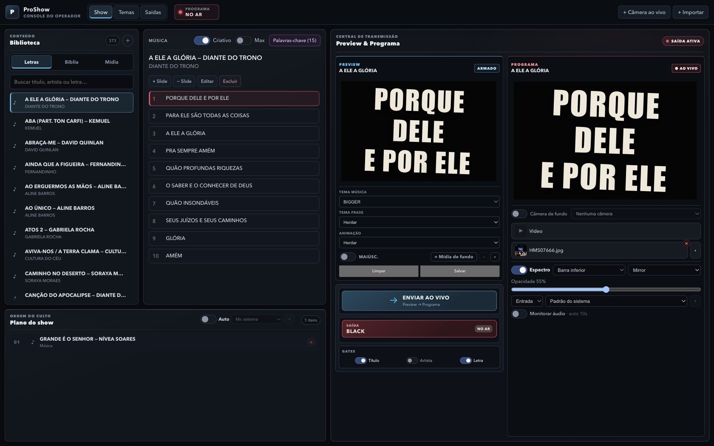
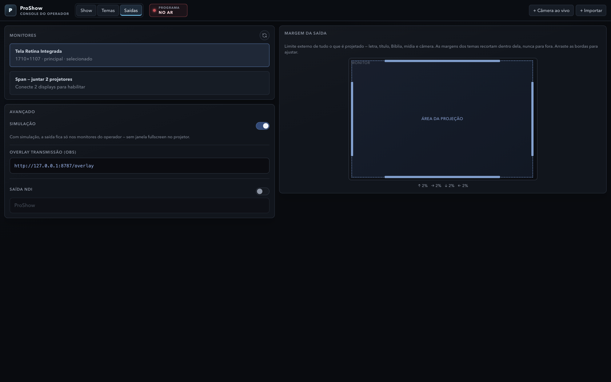

# Manual do operador — ProShow

Guia completo do console: fluxo ao vivo, cada painel, atalhos e persistência.
As imagens são capturas do app em execução.

**Duas janelas:** Operador (este manual) e Saída (projetor). Sem segundo
monitor, a saída fica em **simulação** dentro do próprio console.

**Servidor local:** `http://localhost:8787` (overlay OBS e `live.json`).

---

## Índice

1. [Visão geral](#1-visão-geral)
2. [Fluxo ao vivo (passo a passo)](#2-fluxo-ao-vivo-passo-a-passo)
3. [Atalhos de teclado](#3-atalhos-de-teclado)
4. [Biblioteca — Letras](#4-biblioteca--letras)
5. [Editor de música e seções](#5-editor-de-música-e-seções)
6. [Biblioteca — Bíblia](#6-biblioteca--bíblia)
7. [Biblioteca — Mídia e web](#7-biblioteca--mídia-e-web)
8. [Detalhe da música e Criativo](#8-detalhe-da-música-e-criativo)
9. [Central de transmissão](#9-central-de-transmissão)
10. [Programa — gatilhos, câmera de fundo, transporte](#10-programa--gatilhos-câmera-de-fundo-transporte)
11. [Plano do show e Auto](#11-plano-do-show-e-auto)
12. [Espectro](#12-espectro)
13. [Aba Temas](#13-aba-temas)
14. [Aba Saídas](#14-aba-saídas)
15. [Câmera ao vivo](#15-câmera-ao-vivo)
16. [Onde os dados ficam salvos](#16-onde-os-dados-ficam-salvos)
17. [Limites e boas práticas](#17-limites-e-boas-práticas)

---

## 1. Visão geral



### Barra superior

| Elemento | Função |
|---|---|
| **ProShow · Console do operador** | Identidade da janela |
| **Show** | Culto: biblioteca, plano, Preview, Programa |
| **Temas** | Tipografia e layout WYSIWYG |
| **Saídas** | Monitores, simulação, overlay, NDI, margem |
| **PROGRAMA NO AR** / **BLACK** | Estado da saída |
| **+ Câmera ao vivo** | Insere câmera no plano (modal) |
| **+ Importar** | Mídia · URL · Holyrics |

### Layout da aba Show (esquerda → direita)

1. **Biblioteca** (Letras / Bíblia / Mídia) + **Plano do show** embaixo  
2. **Detalhe** do item (slides, versículos, metadados)  
3. **Central de transmissão** — Preview, ENVIAR AO VIVO, gates, BLACK  
4. **Programa** — o que está no ar + gatilhos + espectro  

Nada aparece no projetor sem comando explícito.

---

## 2. Fluxo ao vivo (passo a passo)


### Ideia central

```
Biblioteca  →  Plano (opcional)  →  PREVIEW (mudo)  →  enviar  →  PROGRAMA (com som)
```

| Etapa | O que acontece |
|---|---|
| **Armar** | Clique na biblioteca, no plano ou num slide → o **Preview** mostra o conteúdo com badge **ARMADO**. Ainda não está no projetor. |
| **Enviar** | Botão **ENVIAR AO VIVO**, tecla **Espaço** / **Enter**, ou **duplo clique** (frase, preview, plano ou item da biblioteca). |
| **Programa** | Badge **● AO VIVO**. É o que vai ao projetor, overlay e NDI. |
| **Próxima** | Depois de enviar com Espaço/Enter, o Preview **arma a próxima** parte/slide automaticamente. |
| **Black** | Tecla **B** ou botão **SAÍDA BLACK** — tela preta sem trocar o item “por baixo”. Ligar de novo só restaura a visibilidade. |

### Regras importantes

- **Preview nunca tem áudio.** Som só no Programa / Saída.
- Duplo clique na **biblioteca** costuma: colocar no plano + ir ao ar + armar a seguinte.
- Clique simples na biblioteca: só Preview (não “suja” o plano sem intenção).
- **Gates** (Título / Artista / Letra) cortam camadas no ar **sem** mudar o item — e só aparecem se o tema também permitir (AND).
- Com **Criativo** ligado, o envio empilha frases artisticamente (ver §8).
- Com **Auto** ligado, a voz pode avançar o plano sozinha (ver §11) — teclas manuais pausam o Auto por alguns segundos.

### Ordem típica de um culto

1. Monte o **Plano do show** (arraste da biblioteca ou use **+ plano** na Bíblia).  
2. Clique no primeiro item → confira no Preview.  
3. **ENVIAR AO VIVO** (ou Enter).  
4. Avance slides com setas + Enter, ou deixe o **Auto** ajudar.  
5. Use **B** nos momentos de transição / oração.  
6. Gatilhos de **imagem/vídeo** na coluna Programa para inserts rápidos.

---

## 3. Atalhos de teclado

Válidos na aba **Show** (na aba **Saídas** os atalhos de conteúdo ficam desligados).  
Em campos de texto (`input` / `textarea`) a maioria não dispara — exceto onde indicado.

| Tecla | Ação |
|---|---|
| **Ctrl+Tab** / **Ctrl+Shift+Tab** | Cicla Letras → Bíblia → Mídia |
| **Tab** / **Shift+Tab** | Foco: Biblioteca ↔ Detalhe (frases) ↔ Plano |
| **↑ ↓ ← →** | Navega na zona focada (lista, slides, versos, plano) |
| **Espaço** / **Enter** | Envia ao vivo **e** arma a próxima |
| **B** | Alterna BLACK ↔ AO VIVO |
| **Esc** | Fecha modal/overlay; se não houver, manda BLACK |
| **Delete** / **Backspace** | No plano: remove item; na Mídia: apaga arquivo (com confirmação) |
| Digitar (zona Letras) | Foca a busca da biblioteca |
| Digitar (zona Bíblia) | Jump livro → capítulo → verso |

**Global (Electron):** `Cmd/Ctrl+Shift+F` — reafirma a janela de saída na frente.

**No editor de música:** `Esc` fecha · `⌘/Ctrl+Z` desfaz · `⌘⇧Z` / `Ctrl+Y` refaz.

### Navegação com setas (detalhe)

- **Letras (lista):** ↑↓ na lista · → entra na música · ← volta à lista  
- **Slides da música:** ↑↓ muda o Preview  
- **Bíblia:** ↑↓ versos ou partes · → entra nas partes · ← volta aos versos  
- **Plano:** ↑↓ seleciona item  

Title das frases no detalhe: *“1 clique: preview · setas: navega · Enter/duplo clique: ao vivo e avança”*.

---

## 4. Biblioteca — Letras


| Controle | Função |
|---|---|
| Aba **Letras** | Lista de músicas locais |
| Busca | `Buscar título, artista ou letra…` |
| Contador | Quantidade de músicas |
| **Nova música** (+) | Abre o editor em branco |
| Clique | Arma Preview (não entra no plano) |
| Duplo clique | Plano + AO VIVO + arma próxima |
| Arrastar → plano | Adiciona cópia no culto |

Cada item mostra título e artista. A biblioteca persiste em disco (ver §16).

---

## 5. Editor de música e seções


Abre com **Editar** no detalhe da música, ou **Nova música**.

### Campos e tags

| Controle | Função |
|---|---|
| **Título** | Nome da música; ao digitar, sugestões da biblioteca e busca online |
| **Artista / autor** | Opcional |
| Tags **Refrão · Coro · Pré-coro · Ponte · Verso** | Marcam seções (variantes A/B/C…) |
| Desfazer / Refazer | Histórico local da edição |
| Linhas | Digite como texto contínuo; alça **⋮⋮** arrasta a linha |
| **Tema padrão** | Tema desta música (`Tema global` = herda a aba Temas) |
| **Cancelar** / **Salvar** | Fecha / grava; avisa se houver alterações não salvas |

### Comportamento das linhas

- **Enter** parte a linha.  
- **Backspace** no início junta com a anterior.  
- **Shift+setas** ou arraste: seleção múltipla.  
- **Delete** (ou Backspace com várias linhas): remove a seleção.  
- Arrastar até uma **tag**: cria nova variante da seção.  
- Arrastar até outro bloco: **mescla**.  
- Seção só com linha em branco some ao sair do campo.

### Busca online

Se a API estiver configurada (chave no operador / prefs), digitar o título sugere resultados. O resultado **sempre** abre no editor para revisão — nunca vai direto ao ar.

Se a música não tiver seções salvas, o app pode **inferir** refrão por blocos que se repetem (ajuda o Auto e a organização).

---

## 6. Biblioteca — Bíblia



Os arquivos de versão ficam em `data/bible/` (**não** vêm no repositório público por copyright). Sem arquivos, a aba mostra poucas ou nenhuma versão.

| Controle | Função |
|---|---|
| **Versão** | Tradução instalada |
| **Livro** / **Cap.** | Navegação |
| **De** / **Até** | Intervalo de versículos |
| **+ plano** | Coloca o intervalo no plano do culto |
| Lista de versos | 1 clique seleciona · 2 cliques inicia apresentação |
| Digitar na zona Bíblia | Jump: livro → capítulo → verso |

### Detalhe da passagem

| Controle | Função |
|---|---|
| **Enviar ao vivo** | Projeta a passagem |
| **+ Plano** | Adiciona ao plano |
| **Tema** | Tema só da Bíblia (independente do tema de louvor) |
| **Referência** / **Versículo** | Mostra ou esconde referência e texto |
| Partes | Passagem longa repartida pelo tema — navegável sem encolher a fonte |

---

## 7. Biblioteca — Mídia e web



| Controle | Função |
|---|---|
| **+ Mídia** | Importa arquivos (vídeo, áudio, imagem, PDF/deck) |
| **+ URL** | Modal: página web, YouTube ou link direto |
| Arrastar arquivos | Também importa |
| **× Remover mídia** | Apaga do disco (confirmação; irreversível) |

O detalhe mostra tipo, arquivo, formato, resolução, duração, codecs, etc.

### No ar

- Play / pause / mute / reiniciar no transporte (coluna Programa quando aplicável).  
- **Áudio (MP3/WAV/…):** o player não cobre o fundo; use a arte do **tema** (imagem/vídeo) ou câmera de fundo. Trocar tema/fundo no Preview só vai ao ar no **Enviar** — a música em curso não reinicia.  
- **Isolar voz** (RNNoise): opcional no áudio do vídeo ou da câmera. Se falhar ao entrar ao vivo, a reprodução segue **sem** o filtro.  
- PDF/deck: navegação por página / scroll; o recorte da viewport pode ir ao ar.  
- **Site (não-YouTube):** barra Voltar / Avançar / Início / Ao vivo; ao enviar, captura um frame da região útil.  
- **YouTube:** segue como web embarcado.

### Gatilhos rápidos (coluna Programa)

Slots **Vídeo** e **Imagem**: um clique manda ao ar na hora. Imagem tem ajuste **Caber / Cobrir / Esticar**. O **nome do arquivo** aparece só no chrome do operador — **não** no centro da projeção.

---

## 8. Detalhe da música e Criativo



Título do painel muda com o tipo: Música, Vídeo, Imagem, Câmera, Bíblia, Site…

### Toolbar da letra

| Controle | Função |
|---|---|
| **+ Slide** / **− Slide** | Adiciona ou remove frase |
| **Editar** | Abre o editor de seções |
| **Excluir** | Remove a música da biblioteca |
| Lista numerada | Clique = Preview · Enter/duplo = ao vivo · `●` = tema próprio na frase |

### Criativo

| Controle | Função |
|---|---|
| **Criativo** | Uma frase por vez, posição/layout artísticos |
| **Max** | Empilha até 3 frases (só com Criativo ligado) |
| **Palavras-chave (N)** | Overlay: palavras destacadas nas composições |

No overlay de palavras-chave: adicione termos, clique na chip para remover, **Esc** fecha. A lista fica salva neste computador.

Ligue o Criativo **antes** de enviar ao vivo. A mesma frase pode sair com arranjo diferente a cada envio (semente).

---

## 9. Central de transmissão


### Preview

| UI | Significado |
|---|---|
| Badge **ARMADO** | Conteúdo pronto para ir ao ar |
| Duplo clique no quadro | Envia ao Programa e arma a seguinte |
| ✎ | Editar câmera do preview (se for câmera) |

### Barra de estilo (letra no Preview)

| Controle | Função |
|---|---|
| **Tema música** | Global ou tema nomeado da música |
| **Tema frase** | Herdar ou override só desta frase |
| **Animação** | Herdar, Fade, Slide…, Nenhuma |
| **MAIÚSC.** | Força maiúsculas |
| **+ Mídia de fundo** | Imagem/vídeo só nesta música |
| **Limpar** / **Salvar** | Limpa estilo da frase / grava na música |

### Entre Preview e Programa

| Controle | Função |
|---|---|
| **ENVIAR AO VIVO** (`Preview → Programa`) | Projeta o armado |
| **SAÍDA BLACK** / **AO VIVO** | Corta ou restaura a visibilidade |
| Estado **NO AR** / **OFF** | Espelho de `visible` |

### Gates

Chips **Título · Artista · Letra**. Só aparecem no ar se o **tema também** tiver essa camada ligada (AND). Útil para cortar título no meio do louvor sem editar o tema.

### Programa

| UI | Significado |
|---|---|
| **● AO VIVO** / **BLACK** | Visibilidade |
| Título do item | Chrome do operador (não é a projeção tipográfica da mídia) |
| ✎ | Editar câmera no ar |

---

## 10. Programa — gatilhos, câmera de fundo, transporte

### Câmera de fundo

Toggle **Câmera de fundo** + seletor de device. Fica **atrás** de letra/bíblia (diferente da câmera principal do plano).

### Slots Vídeo / Imagem

Ver §7. Persistem entre sessões nas preferências do operador.

### Transporte de mídia

| Controle | Função |
|---|---|
| Play / Pause | Reprodução no Programa |
| Som / Mudo | Áudio |
| **Isolar voz** | RNNoise no canal |
| Seek / Loop / Volume | Transporte completo |
| (YouTube / câmera) | Às vezes só volume + mute |

---

## 11. Plano do show e Auto


### Plano (`Ordem do culto`)

| UI | Função |
|---|---|
| Lista numerada | Ordem do culto |
| Badge **NO AR** / **PREVIEW** | Item no Programa / no Preview |
| ✎ (câmera) | Editar device/legenda |
| × | Remove do plano (confirmação) |
| Vazio | *“Arraste itens da biblioteca para montar o plano.”* |
| Arrastar | Reordenar · soltar da biblioteca · soltar arquivos |

- 1 clique: Preview no 1º slide do item  
- 2 cliques: AO VIVO no 1º + arma a seguinte  

O plano **persiste** ao fechar o app (`show-plan.json`).

### Auto (voz)

| Controle | Função |
|---|---|
| Interruptor **Auto** | Liga escuta + Vosk |
| Seletor de entrada | Mic sistema ou device |
| Canais | Mix, L, R ou canal N |

**Status possíveis:** `vosk…` · `aguardando ao vivo…` · `ouvindo…` · `silêncio` · `match` · `avançando…` · `black · ouvindo` · `pausa (tecla)` · `erro`.

Comportamento:

1. Monta grammar com aberturas das linhas candidatas do plano.  
2. Prioriza vizinhos do AO VIVO / Preview e seções (verso → pré → refrão…).  
3. Match → envia ao vivo e arma a seguinte.  
4. Silêncio longo → BLACK, mas continua ouvindo.  
5. Espaço/Enter/B manuais **suprimem** o Auto por alguns segundos (evita briga com o operador).

Tudo **no dispositivo** — áudio não sobe para nuvem. Em culto ruidoso, use como assistência; teclado continua o caminho seguro.

---

## 12. Espectro


Camada **visual** (só lê áudio e desenha). Não mexe no som da mesa.

| Controle | Função |
|---|---|
| **Espectro** | Liga/desliga |
| Posição | **Fundo** (tela cheia) ou **Barra inferior** (HUD) |
| Estilo | Aurora, Horizon, Halo, Ember, Neon, Mirror, Silk, Radial, Mesh, Particles |
| **Opacidade** | 10–100% |
| Fonte | Entrada · Câmera · Mídia |
| Device / canal | Mesma lógica do Auto |
| **Monitorar áudio · auto 10s** | Ouvir no Mac; desliga sozinho (evita loop) |

Em **câmera ao vivo** ou **mídia** full-bleed no Programa, a barra inferior pode entrar sozinha (sem gravar isso como preferência permanente). Câmera de fundo atrás de letra mantém a posição que você escolheu.

---

## 13. Aba Temas


### Rail esquerdo

| Controle | Função |
|---|---|
| Filtro | `Digite para filtrar…` |
| Lista de temas | Inclui presets (ex.: lower third) |
| **Editar ao vivo** | Aplica no ar enquanto você edita |
| **Padrão** | Tema default da saída |
| **Salvar** / **Salvar como** / **Aplicar** | Disco / novo tema / manda à saída |
| **Importar JSON…** | Importa tema |
| **Fontes Google** / **Instaladas** | Catálogo e download local |

### Canvas (centro)

- Proporção real da saída.  
- **Margem da saída** (laranja): limite físico.  
- **Área do texto** (tracejado): onde a letra vive.  
- Clique em **Título** ou **Letra** para editar cada um.  
- Arraste handles para posição/tamanho conforme o modo.

### Fundo e “mostrar na projeção”

| Controle | Função |
|---|---|
| Imagem… / Vídeo (loop)… / Limpar | Fundo do tema |
| Cor de fundo (fallback) | Se não houver mídia |
| Título / referência · Artista · Letra / versículo | Camadas visíveis |
| Tudo em MAIÚSCULAS | Força caps no tema |

### Ajustes (direita)

| Controle | Função |
|---|---|
| **Fonte** | Família (Google importada ou sistema) |
| **Tamanho** | Título em vw; letra com **Preencher** ou fixo |
| **Linhas** | Ilimitado ou máximo — o que não cabe vira **slide novo** (não encolhe) |
| Cor · Âncora · Alinhamento · Rotação | Tipografia |
| **Animação** + duração + intervalo | Entrada da frase |

**Fixo (vw):** overflow → novo slide com reticências na emenda.  
**Preencher:** maior tamanho que ainda cabe na área.

---

## 14. Aba Saídas



### Monitores

- Lista displays (resolução, principal/secundário, selecionado).  
- Clique: saída **single** naquele monitor.  
- **Span — juntar 2 projetores**: precisa de ≥2 displays conectados.  
- Botão atualizar: relê a lista.

### Avançado

| Controle | Função |
|---|---|
| **Simulação** | ON = saída só no operador (sem fullscreen no projetor). Útil no ensaio. |
| **Overlay transmissão (OBS)** | URL do Browser Source, ex. `http://127.0.0.1:8787/overlay` |
| **Saída NDI** | Liga stream NDI; nome padrão `ProShow` |

Também existe `http://localhost:8787/live.json` para estado em JSON.

### Margem da saída

Limite externo de **tudo** (letra, título, Bíblia, mídia, câmera). Temas só recortam **dentro** dela. Arraste as bordas no diagrama; valores em % (↑ → ↓ ←).

---

## 15. Câmera ao vivo

### Inserir (`+ Câmera ao vivo`)

- Lista de devices · 1 clique seleciona · 2 cliques ou **Adicionar** confirma.  
- **Legenda** (nome da pessoa no canto).  
- **Isolar voz (áudio desta câmera)**.  
- **Atualizar lista** / **Fechar** / **Adicionar ao vivo**.

### Editar (✎ no Preview ou Programa)

Troca device, legenda e Isolar voz; **Salvar** sincroniza se a câmera estiver no ar.

Câmera do **plano** = vídeo principal (substitui letra).  
**Câmera de fundo** = atrás do texto (§10).

---

## 16. Onde os dados ficam salvos

Tudo sob `~/ible-projection/` (macOS/Linux) / perfil do usuário no Windows:

| Dado | Onde |
|---|---|
| Plano do culto | `library/show-plan.json` |
| Músicas | `library/songs.json` (+ estilos em `song-styles.json`) |
| Preferências (simulação, gates, NDI, Criativo, slots, espectro, Auto, câmera de fundo…) | `operator-prefs.json` |
| Temas | `themes/` |
| Mídia importada | `media/` |
| Margem da saída | `output-safe-area.json` |
| Palavras-chave artísticas / fallbacks | `localStorage` do app |

---

## 17. Limites e boas práticas

- Validação intensa no **macOS**. Windows/Linux: ver [BUILD.md](BUILD.md) (binários nativos).  
- Bíblia: você coloca as versões em `data/bible/`.  
- **Auto:** assistência — teste no seu ambiente antes do culto.  
- Release Mac público: assinatura **ad-hoc** (não notarizada pela Apple). Se aparecer “danificado… Lixo”, veja [BUILD.md](BUILD.md).  
- Ensaio: deixe **Simulação** ligada; no culto, desligue e escolha o monitor do projetor.  
- Preferência: armar no Preview, olhar, só então **ENVIAR AO VIVO**.  
- Gates + tema: se o título “não some”, confira os dois lados (gate **e** tema).

---

## Começando pelo código

```bash
git clone https://github.com/davigodoy/proshow.git
cd proshow/prototypes/electron-shell
npm install
npm run dev
```

Instaladores: [BUILD.md](BUILD.md) · [Releases](https://github.com/davigodoy/proshow/releases).
