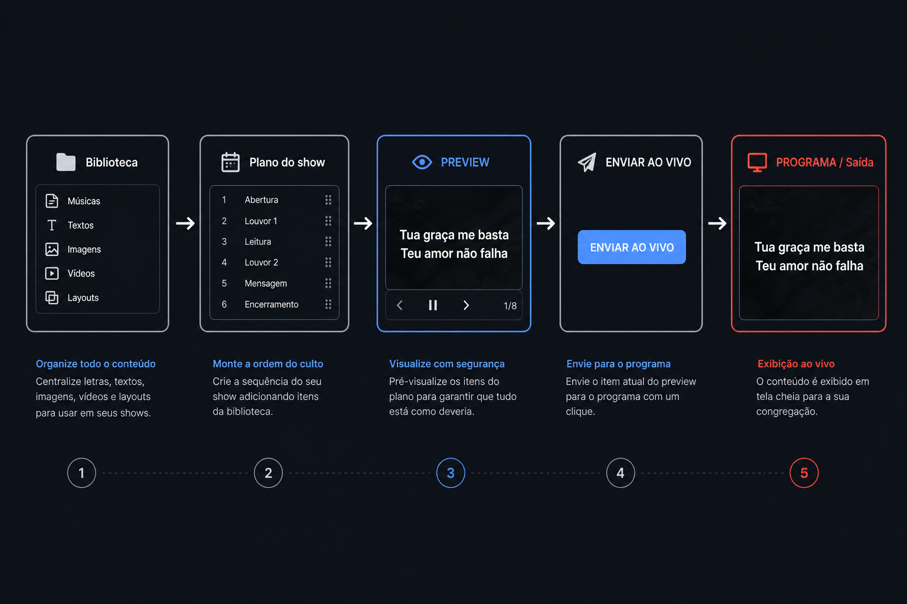
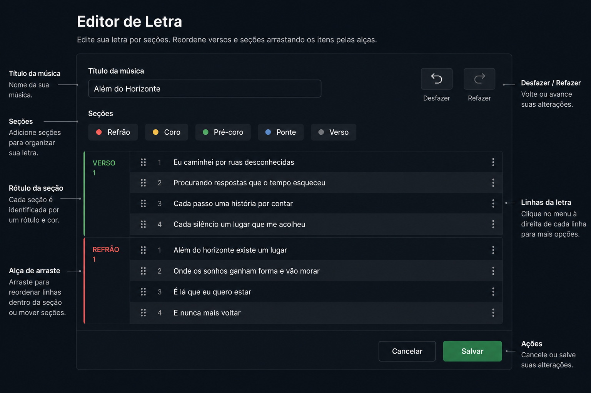
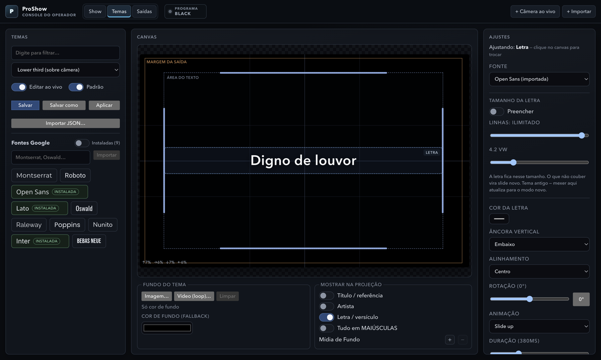
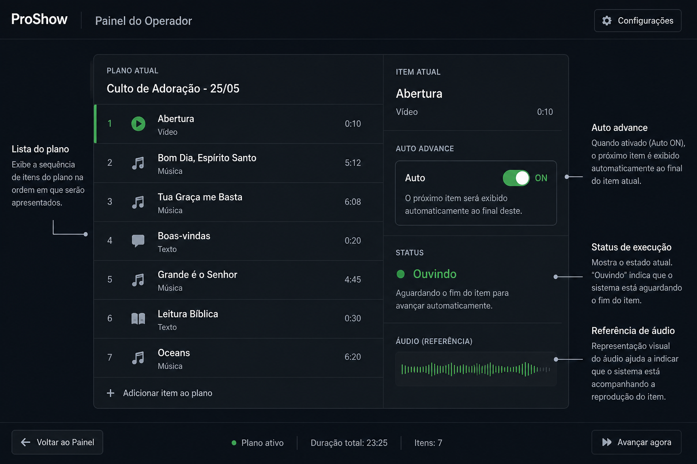
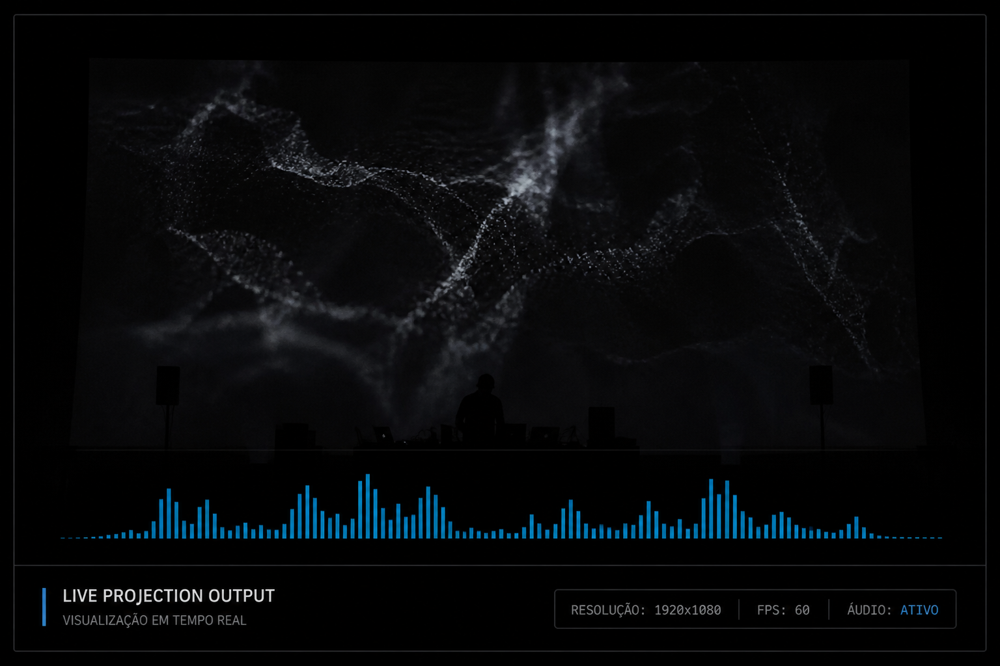

# Funcionalidades — ProShow

Guia do que o ProShow faz, seção a seção. Duas janelas Electron — **Operador**
(console) e **Saída** (projetor / OBS / NDI) — mais um servidor HTTP local.

As ilustrações abaixo são esquemáticas (para leitura rápida). As fotos de uso
real do console e do editor de temas estão no [README](../README.md).

---

## Fluxo ao vivo

Nada vai ao projetor sem comando. O operador **arma** no Preview e **envia**
ao Programa (duplo clique, Enter, ou botão). O Preview **nunca tem áudio**;
só o Programa / janela de saída tocam som.

| Peça | Função |
|---|---|
| Biblioteca | Letras, Bíblia, mídia — busca e arrasta para o plano |
| Plano do show | Ordem do culto (ainda não persiste entre sessões) |
| Preview | Ensaios do que será enviado; silencioso |
| Programa | O que está no ar (projetor, overlay, NDI) |

Abas do console: **Show** · **Temas** · **Saídas**.

---

## Conteúdo

### Letras

Biblioteca local. Busca online (API configurável pelo operador) — o resultado
**sempre** abre no editor para revisão; nunca cai direto no ar.

#### Editor de letra e seções

- Fluxo contínuo (como um bloco de texto), não cartões soltos.
- Seções: **Verso**, **Refrão**, **Coro**, **Pré-coro**, **Ponte**.
- Arraste pela alça até uma tag (nova variante B/C…) ou até um bloco já
  existente (mescla).
- Shift+setas ou arraste entre linhas: seleção múltipla.
- **Delete** (e Backspace com várias linhas): remove a seleção.
- Seção só com linha em branco some ao sair do campo.
- Desfazer / refazer na barra de tags.
- Digite o título: sugestões da biblioteca e da busca online.
- Tema padrão da música; confirmação ao fechar com alterações não salvas.
- Estilo por frase (tamanho, cor, fonte, animação) opcionalmente salvo como
  padrão da música.

Se não houver seções gravadas, o app **infere** refrão por blocos que se
repetem — útil para o Auto e para organizar depois.

### Bíblia

Várias versões (arquivos em `data/bible/` — **não** vêm no repositório por
copyright). Passagens longas viram partes navegáveis (seta / Enter); a fonte
não encolhe até ficar ilegível.

### Mídia

Vídeo, áudio, imagem, PDF e apresentação (deck), com play / pause / loop,
seek e navegação de página. Isolamento de voz (RNNoise) opcional no áudio
do vídeo. Se o filtro falhar ao entrar ao vivo, a reprodução segue sem ele.

### Web

Página externa como fonte, com recorte (crop) da região útil.

### Câmera

Câmera ao vivo no programa, com legenda opcional e isolamento de voz local
(RNNoise). Diferente da **câmera de fundo** (atrás de letra/bíblia).

---

## Temas

Canvas WYSIWYG: o que você vê é o que projeta (mesma medição no editor e na
saída). Título e letra com handles independentes.

- Fonte (Google Fonts com import local, ou sistema), tamanho, peso, cor,
  tracking, leading, alinhamento, âncora vertical, offset e rotação —
  separados para título e letra.
- **Tamanho fixo** (`vw`): o que não cabe vira slide novo, com reticências
  na emenda — nunca encolhe.
- **Preencher**: maior tamanho que ainda cabe na área.
- **Margem de saída**: limite físico único (`clip-path`). Tema, texto, mídia
  e câmera respeitam essa margem.

---

## Criativo

A frase vira peça gráfica, não bloco corrido.

- **Solo**: uma frase; layout sorteado (bloco, coluna, cascata, carimbo).
  Fonte calculada simulando a quebra na região — a maior uniforme que cabe.
- **Max**: até 3 frases em mosaico, com hierarquia (a mais nova em destaque).
- Semente: a mesma frase pode sair com arranjo diferente a cada envio.

---

## Auto — avanço por voz

O app já conhece o plano. Em vez de ditado aberto, escuta a entrada escolhida,
transcreve **no dispositivo** (Vosk + grammar fechada das aberturas das
linhas candidatas) e compara com o plano.

- Prioriza vizinhos do AO VIVO / Preview; respeita seções (verso → pré →
  coro/refrão…) quando a estrutura está disponível.
- Entrada de áudio **própria** (independente do espectro).
- Tudo local — sem enviar áudio a serviço externo.
- Ainda exige uso cuidadoso no culto (falsos positivos / ambiente ruidoso);
  teclado e clique continuam o caminho seguro.

Ligar: painel **Plano do show** → controle **Auto**.

---

## Saída e integração

### Monitores

Saída em monitor dedicado, ou **span** (dois projetores como uma tela).

### Overlay OBS

Com o app aberto:

| URL | Uso |
|---|---|
| `http://localhost:8787/overlay` | Browser Source — mesmo texto da tela |
| `http://localhost:8787/live.json` | Estado em JSON |

### NDI

Aba **Saídas** → liga NDI; a projeção aparece na rede (vMix, OBS+NDI, etc.).

### Espectro de áudio

Camada visual (só lê e desenha). Fontes: mesa/mic, câmera ao vivo, ou áudio
da mídia. Estilos: Neon, Mirror, Silk, Radial, Mesh, Particles.

- **Fundo** (tela cheia) ou **barra inferior** (HUD).
- Em **câmera ao vivo** ou **mídia** no Programa, a barra inferior entra
  sozinha. Câmera de fundo em letra/bíblia mantém a posição escolhida.
- “Ouvir no Mac” com auto-off (evita loop com a mesa).

---

## Operação

### Áudio

| Onde | Som |
|---|---|
| Preview | Sempre mudo |
| Programa / Saída | Com som (e Isolar voz se ligado) |

### Atalhos

Enviar ao ar, avançar/voltar, black, armar próxima — cobrem o fluxo ao vivo
(detalhe dos atalhos na UI e no uso diário).

---

## Limites conhecidos

- Uso intenso validado sobretudo no **macOS**. Windows/Linux compilam; ver
  [BUILD.md](BUILD.md) sobre binários nativos.
- Bíblia: você fornece os arquivos em `data/bible/`.
- Plano do show **não** persiste entre sessões (ainda).
